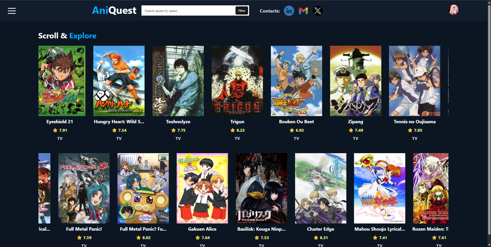
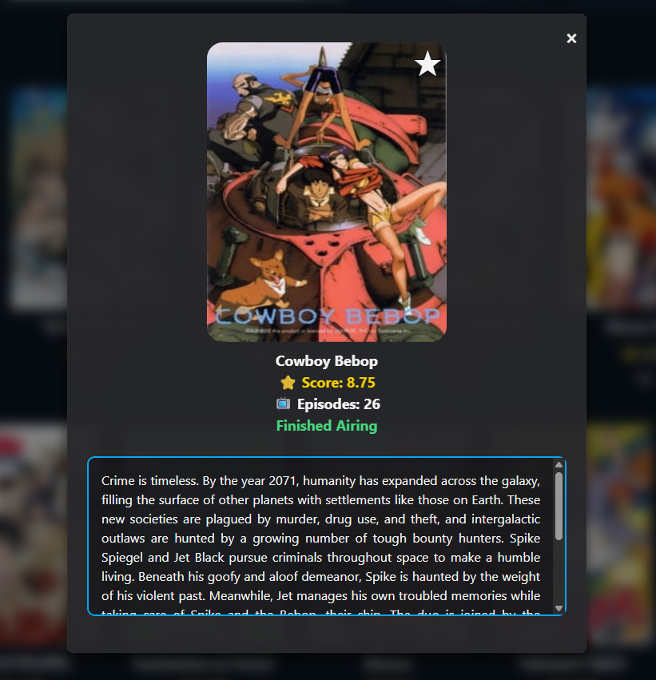
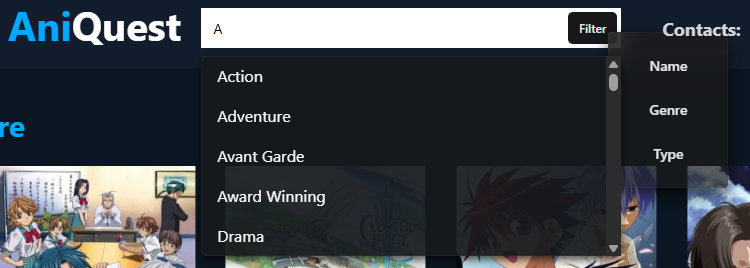
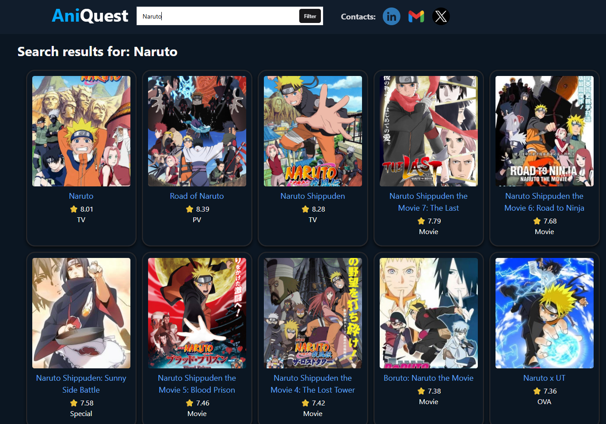
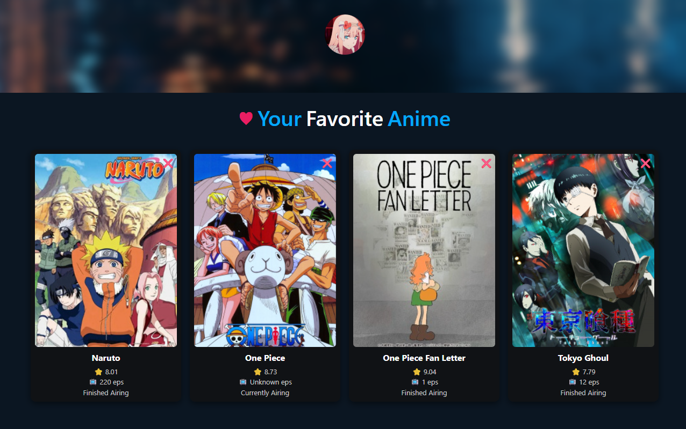

# AniQuest
This was my first ever project!

## 📖 About Ani

AniQuest is an anime discovery and tracking app. <br>
Its intent was to find information on anime and favorite them.


## 📸 Screenshots
### Landing Page 🏠


### Anime Popup 💬

Shows more details of the anime when you clicked on it from the trolley 
### Search Bar and Filter 🔎


Able to switch between Name, Genre and Type depending on what you need to 
search. <br> Has a search prediction filter.

### Search Results Page 📝

Pops up the anime you searched for... <br> 
The anime after arfe filtered by the highest rating
### Favorite Anime Page ❤️

Shows you the anime you favorited... Does not have a database!
## 🔧 Installation

```bash
git clone https://github.com/Devon-Valencia/Anime-App
cd Anime-app

#Frontend
npm install
cd frontend
npm run dev

#Backend
python -m venv venv
source venv/bin/activate      
pip install flask flask-cors

cd backend
cd api
python app.py